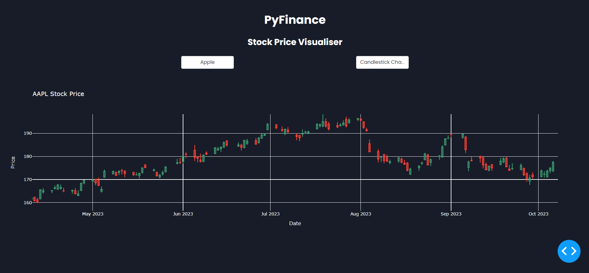

# PyFinance Stock Analysis Pipeline

## Overview
PyFinance is a robust data pipeline designed for a hedge fund that relies on technical analysis for trading. This pipeline processes and analyzes large volumes of historical stock data, specifically Open, High, Low, and Close (OHLC) data, to support further analysis and model development.



## Technologies Used
- Python
- Libraries: pandas, numpy, yfinance, pytest
- Database: SQLite
- Visualization: Dash by Plotly

## Installation
```bash
git clone https://github.com/anayy09/PyFinance.git
cd PyFinance
# Setup a virtual environment (optional)
python -m venv venv
source venv/bin/activate # On Windows use `venv\Scripts\activate`
# Install the required packages
pip install -r requirements.txt
```

## Usage
To run the data pipeline and visualization dashboard:
```bash
python data_pipeline.py
python dashboard.py
```

The scripts perform the following tasks:
- `data_pipeline.py`: Ingests, cleans, transforms, and stores the OHLC data.
- `dashboard.py`: Launches a web-based interactive dashboard for data visualization.

## Data Pipeline
The data pipeline script `data_pipeline.py` performs the following steps:

1. Data Ingestion:
   - Ingests OHLC data from multiple sources.
   - Validates and standardizes the data into a pandas DataFrame.

2. Data Cleaning:
   - Identifies and handles missing values.
   - Detects and corrects outliers.
   - Addresses timestamp inconsistencies.

3. Data Transformation:
   - Calculates technical indicators.
   - Applies feature engineering.
   - Resamples data as required.

4. Data Validation:
   - Implements unit tests for pipeline functionality.
   - Monitors for errors and data quality issues.

5. Data Storage:
   - Stores the processed data in `stock_data.db`.
   - Partitions and optimizes data for efficient querying.

## Visualization Dashboard
The dashboard (`dashboard.py`) is built using Dash and Plotly and allows for interactive data exploration. To view the dashboard, navigate to `http://127.0.0.1:8050/` in your web browser after running the script.

## Testing
Unit tests are included in `test_data_pipeline.py` to ensure the integrity and functionality of the data processing steps. Run tests using pytest:
```bash
pytest test_data_pipeline.py
```

## Contributions
Contributions are welcome! For major changes, please open an issue first to discuss what you would like to change.
